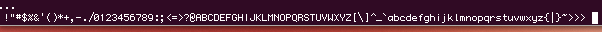
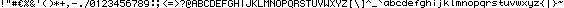

Printer
=======

####11.2.2014
This project is currently lacking a name. We thought about "Monaco9 is seven pixels tall", but it turns out we want to use a font thats eight pixels tall, so we could go with "We need a font" as the current project name.

####12.2.2014
There are many thing that i see as intresting and having potential in this project. First of all i like the idea of developing some functional hardware, i know how to program and i know how to solder, but the things in between are a bit fuzzy for me at the moment and i'd like learn some more about that.

I see the result of this project being something autonomous. I hope that it will be a device that can be used without the assistance of a general-purpose computer. This is going to be a printer (kind of) and a printer should be running a program that can take (formatted) input and give output regardless of the source. The input will be given through I2C, the device will save it in RAM, and then it can be printed whenever you want. There should be no need to reprogram the Flash or EEPROM in order to print a new message. The only time reprogramming should be done is if there's an update to the software.

-Juha

I2C in .WAV
-----------
####13.2.2014

I2C is a communicatoin protocol, not a filetype. But it can still be thought of as signals that can be recorded. I2C has two busses, so it can be recorded as stereo audio, one channel for the serial clock and one for the data. WAV is an audiofile format that enables us to save audio in a lossless manner. WAV is also a really simple filetype to write and it's supported by most platforms. These are the reasons why i chose to use WAV as the medium for saving and transporting data to the microcontroller in the electronic brush.

I need four stereo samples (8 bytes of 8-bit samples) to save and transfer a bit of data. This will make sure that the signals are well in sync and that all data is safetly transfered. I'll be using 8kHz 8-bit audio and it'll give me a transfer speed of 2000 bits per second which is good enough for the application. Since the signal has it's own clock the samplerate can be increased to get a faster transfer. A baud of 2000 bits/s should not be hard to recieve with any microcontroller.

####12.02.2014 17:02

Played around with some fonts. The goal was to find or create a font that would fit within the height of 8 pixels.

The plan is to store the bitmaps for all the symbols in a run-length encoded format, running form top to bottom, left to right (note the order, first vertical, then horizontal). Therefore choosing a font that uses 8 rows and 5 columns allows for storing a symbol using one byte for each column in the bitmap, making the data easy to process. Considering how the device will print the characters, this format is very appropriate.

For a reference on the printing method, look at [txtBOMBER](http://www.behance.net/gallery/txtBOMBER/406136) or [Time Writer](http://oliviervanherpt.nl/time-writer/), the idea for this project is based of those two.

I created a draft for a font based off Monaco. Turns out uppercase letters fit quite nicely within the the 5x8 pixel constraint, even without modifications. Lowercase letters are more problematic. I tried squeezing the all the lowercase letters into the 5x8 format, but the result wasn't too great on some of them.

[Link to the font](./sampleFont0.png)

-jarmo

####13.02.2014 -- Bitmap parsing

Assuming the device will be built around an arduino (likely, since there is one at our disposal) or at least one of ATmega-series microcontrollers, parsing the bitmaps for our font might end up being easier than i expected at first.

In the current design there will be 8 I/O pins used for controlling printing, each controlling one of the 8 print heads. The way symbol bitmaps are stored in the program enables us to simply read a full byte of data form the bitmap and write the value directly to `PORTD`, an 8-bit register where each bit controls the state of one I/O pin.

-jarmo

####14.02.2014

I've decided to use either an Atmel ATmega168 or an ATmega328 microcontroller as the platform for this project. Both microcontrollers have a built-in 2-wire serial interface (TWI) compatible with the I2C protocol. Among other things, the interface includes a Control Unit which can be configured to trigger an interrupt after a variety of events, such as the device being addressed on the I2C bus or after receiving a byte of data from the master.

The interface has support for all four I2C operating modes, although for this particular project only the slave receive mode will be needed.

The interface is described in section 22 "2-wire Serial Interface" of the [datasheet](http://www.atmel.com/images/atmel-8271-8-bit-avr-microcontroller-atmega48a-48pa-88a-88pa-168a-168pa-328-328p_datasheet.pdf)

I'm currently in the process of browsing relevant header files while rereading about the interface in the datasheet, in order to get a better understanding of all the registers involved in using the interface.

-jarmo

####15.02.2014 -- Generating font

I spent some time today generating the `bitmaps[]` array for font.c that contains all the symbol bitmap data for our device. This is a summary of the process.

We've opted to include all ASCII characters within the range [0x20, 0x7e]. ACSII characters below 0x20 are non-printable control characters. Characters above 0x7e include additional special symbols, some Greek letters and various reappearances of letters with different diacritics (glyphs you add to a letter to indicate they sound funny) etc. Characters in the [0x20, 0x7e] range are the most commonly used ones and will suffice for our purposes.

To get started with creating our font I ran a couple of lines of python that output all the characters we want to include in our font:

	
	import sys
	for i in range(0x20, 0x7f):
		sys.stdout.write(chr(i))

output:

	
	!"#$%&'()*+,-./0123456789:;<=>?@ABCDEFGHIJKLMNOPQRSTUVWXYZ[\]^_`abcdefghijklmnopqrstuvwxyz{|}~

I then set the font of my terminal to Monaco and font size to 7 pixels, took a screenshot and opened it in Gimp (image editor). 

Screenshot I started working from:

Final result:

Note: because I have no regard for standards I took the liberty of swapping the dollar sing for a euro sing, in the hopes that it will be more useful.

One of the format options in Gimp to which images can be exported is "C source code header". While the code it generates was not directly compatible with the way our font is stored, adapting it was only a matter search and replace. 

Below is the bitmap for "A" as output by gimp. Zeros and ones are references to a color palette. The image has been rotated 90 degrees clockwise before exporting. Code obviously truncated to exclude the rest of the font.

	static char header_data[] = {
		...
		0,1,1,1,1,1,1,0,
		0,0,0,0,1,0,0,1,
		0,0,0,0,1,0,0,1,
		0,0,0,0,1,0,0,1,
		0,1,1,1,1,1,1,0,
		...
	};
	
Our program stores the same data like so:

	const char bitmap[] PROGMEM = {
		...
		0b01111110,
		0b00001001,
		0b00001001,
		0b00001001,
		0b01111110,
		...
	};

From what I've gathered the literal binary notation starting with 0b used above is not actually standard C. Avr-gcc however supports it, and using it in this case is very convenient.

While it could be more automated, the process described above is simple enough that it can be easily repeated if the need for a new iteration of the font emerges or more symbols are to be added.

-jarmo

####17.2.2014

I started making the text editor for the TI calculator. Currently the keyboard routines support the small and large alphabet, spacebar and numbers. The keys are not ordered in any clever way, so i'm using a table to convert key values to ASCII values. This does take a lot of space (theres a lot of empty entries) but it's still smaller than a big switch-case. Also since the keyboard is quite small the [2ND] and [ALPHA] keys will be used to write capital letters and numbers.

The keyboard layout is such that the primary value of any key is the blue letter on the top right corner of the button (only the alphabet and space). Pressing [2nd] and then any key will return the capital letter of the primary value ([2ND] + space will return 0x00). Pressing [ALPHA] will return the numeric value of the number keys.

The get_next_key() will return the ASCII value of the key pressed (or combination of keys). I'll be using values 0x01 to 0x19 for editor commands and other various purposes. These uses are for example moving the cursor, backspace, error codes for unrecognzed keypresses, sending the data in i2c, opening a symbol menu (to write non-alphanumerics), etc.

I have yet to decide what actions i want to implement in the editor. The best might be to only include concatenating alphanumerics first and add more when i get the rest of the program working and see what's needed.

-Juha

####18.2.2014 -- Computer audio output suitablity for I2C communication
